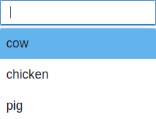
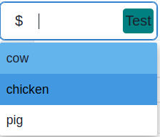
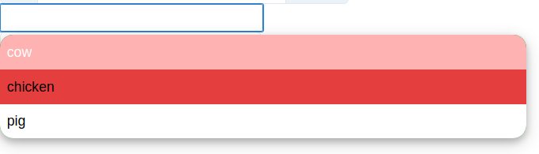

# chakra-ui-easy-autocomplete

> Autocomplete with chakra-ui component

[](https://www.npmjs.com/package/chakra-ui-easy-autocomplete) [](https://standardjs.com)

#### Easy autocomplete for chakra ui







## Install

```bash
npm install --save chakra-ui-easy-autocomplete
```

## Usage

```tsx
import React from 'react'
import { ChakraUIEasyAutoComplete, ChakraUIEasyAutoCompleteSuggestionItemProps } from 'chakra-ui-easy-autocomplete'
import { Box, Text, Button } from '@chakra-ui/react';

const suggestions: Array<ChakraUIEasyAutoCompleteSuggestionItemProps> = [
  {
    label: 'cow',
    value: 'moow'
  },
  {
    label: 'chicken',
    value: 'kotkot'
  },
  {
    label: 'pig',
    value: 'röff röff'
  }
]
const App = () => {
  return <>
    <ChakraUIEasyAutoComplete
      size="sm"
      w="200px"
      suggestions={suggestions}
      onChange={(e: any) => console.log(e.target.value)}
      onSelect={(data: any) => console.log(data)}
      resultNotFoundElement={<Text p={3}>Result not found</Text>}
    />

    <ChakraUIEasyAutoComplete
      inputLeftElement={
        <Box
          color='gray.300'
        >$</Box>
      }
      inputRightElement={
        <Button
          bg='teal'
          borderRadius="4px"
          p={3}
        >Test</Button>
      }
      size="lg"
      w="200px"
      suggestions={suggestions}
      onChange={(e: any) => console.log(e.target.value)}
      onSelect={(data: any) => console.log(data)}
      resultNotFoundElement={<Text>Result not found</Text>}
    />

    <ChakraUIEasyAutoComplete
      inputLeftAddon={
        <Box
          color='gray.300'
        >$</Box>
      }
      inputRightAddon={
        <Button
          bg='teal'
          borderRadius="4px"
          p={3}
        >Test</Button>
      }
      size="lg"
      w="400px"
      suggestions={suggestions}
      onChange={(e: any) => console.log(e.target.value)}
      onSelect={(data: any) => console.log(data)}
      resultNotFoundElement={<Text>Result not found</Text>}
    />
    <ChakraUIEasyAutoComplete
      size="sm"
      w="50%"
      suggestions={suggestions}
      suggestionBoxProps={{ bg: 'green', borderRadius: '15px' }}
      itemProps={(isActive) => {
        return (
          {
            color: isActive ? 'white' : 'black', bg: isActive ? 'red.200' : 'white',
            _hover: { bg: 'red.500' }
          }
        )
      }}
      resultNotFoundProps={{ fontSize: 'xl' }}
      onChange={(e: any) => console.log(e.target.value)}
      onSelect={(data: any) => console.log(data)}
    />
    <ChakraUIEasyAutoComplete
      w="300px"
      suggestions={suggestions}
      onChange={(e: any) => console.log(e.target.value)}
      onSelect={(data: any) => console.log(data)}
      item={(props, data, isActive, index) => <Box {...props} key={index} _hover={{ bg: 'grey' }} h="50px" bg={isActive ? "green" : "yellow"}>{data.label}</Box>}
    />

  </>
}

export default App

```

## License

MIT © [Morayetl](https://github.com/Morayetl)
